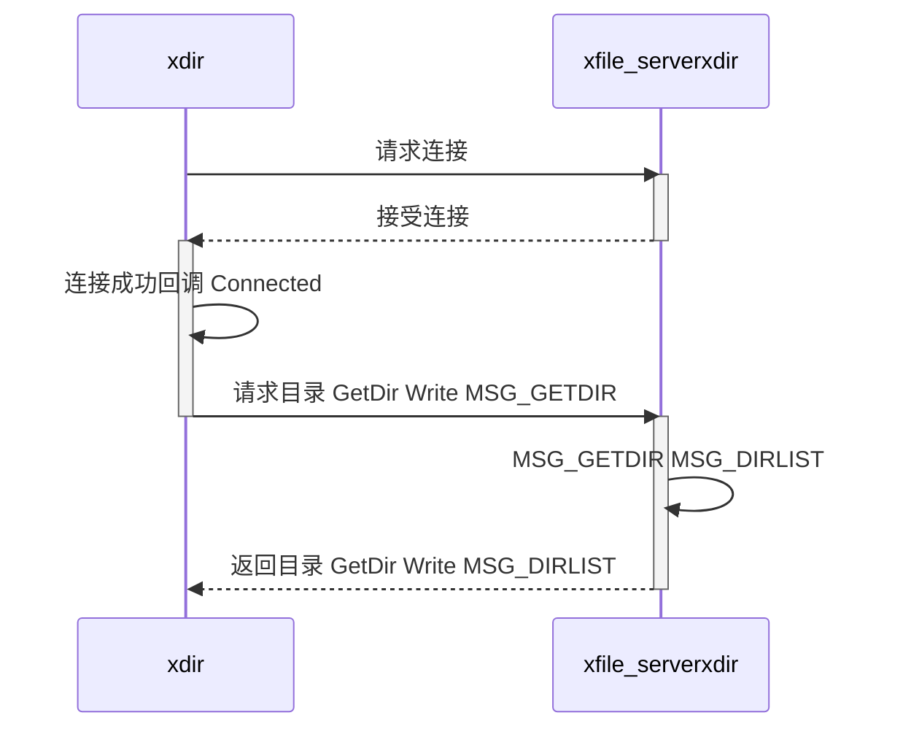

## moudle

### xcom 共有工具模块

- 跨平台的线程池库
- 任务类封装

### xdisk_server 云盘服务器

### xdisk_gui 云盘客户端

## Third Party

**windows**: msvc
**linux**: mingw

- openssl-3.5.1
- libevent-2.1.12-stable
- zlib-1.3.1

## 图图

